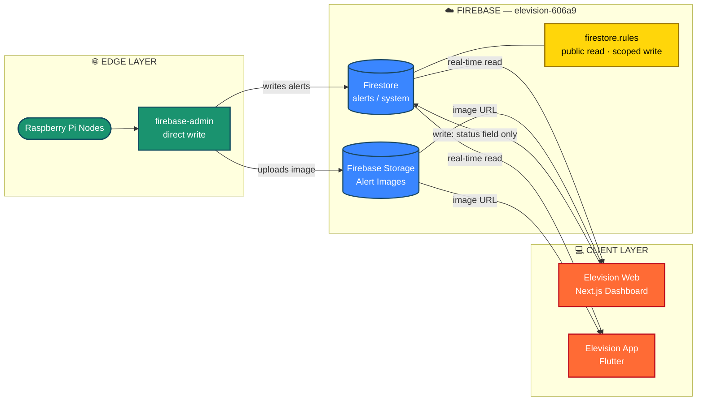
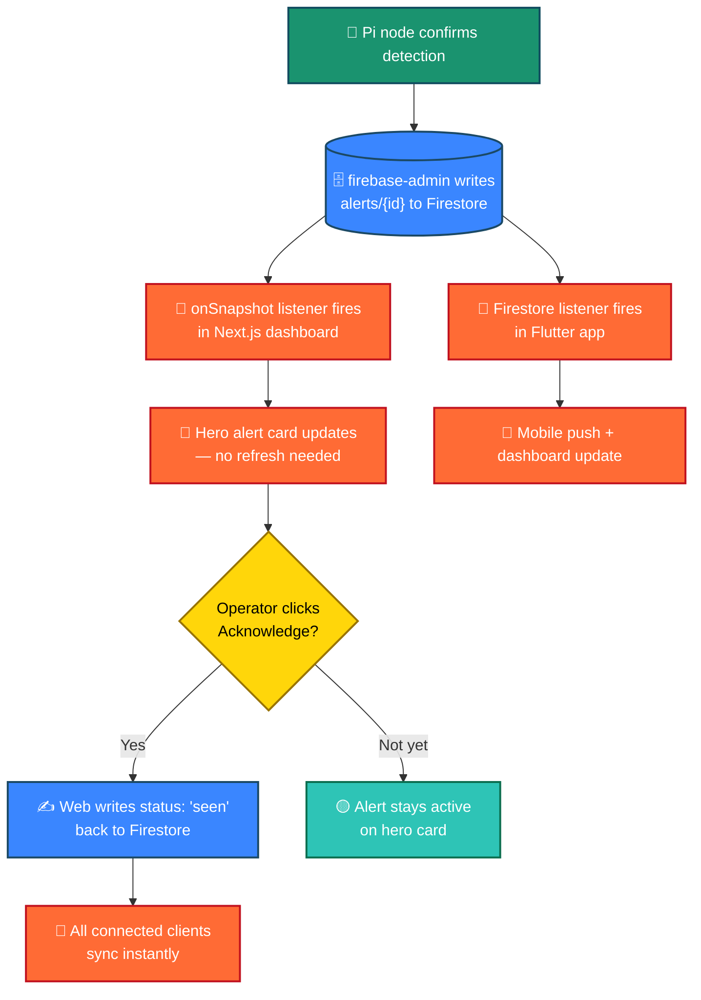
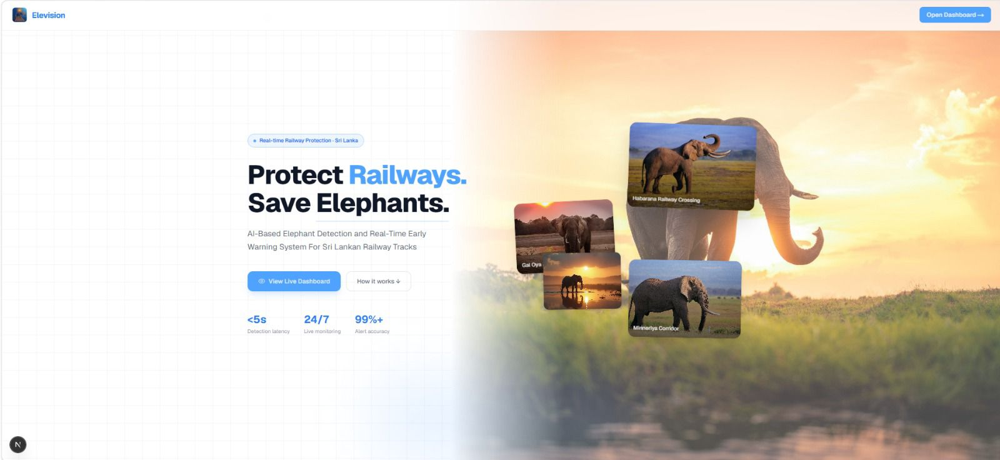
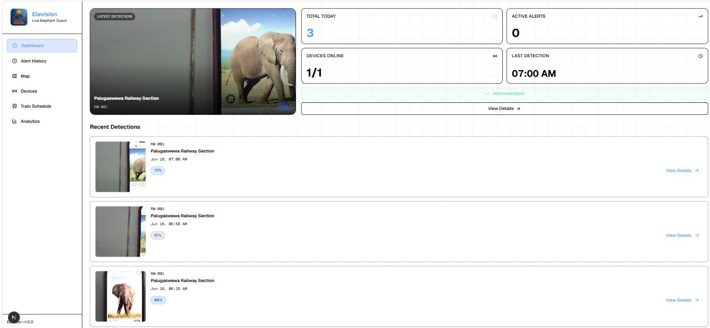
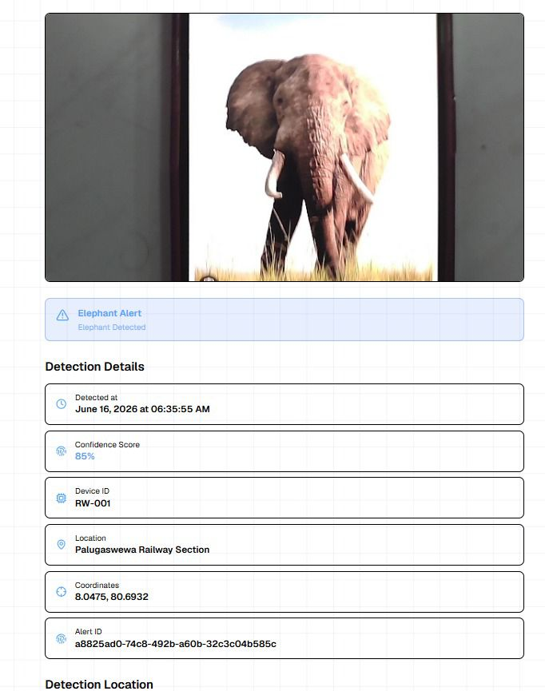
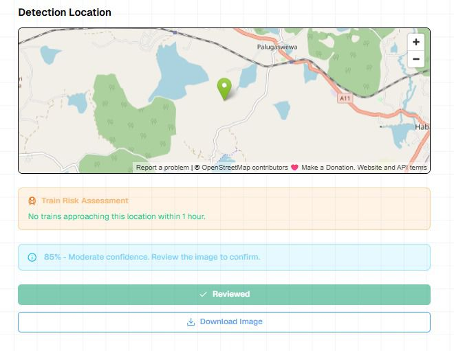
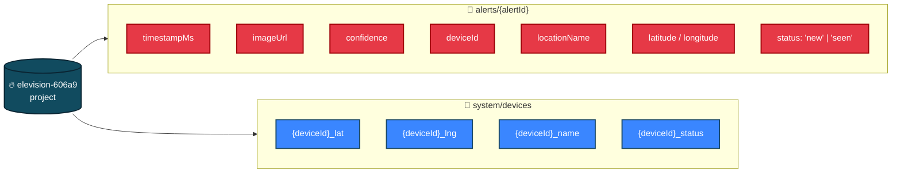
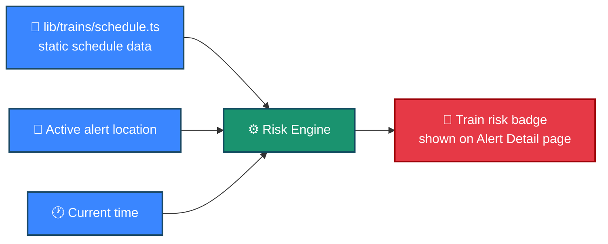
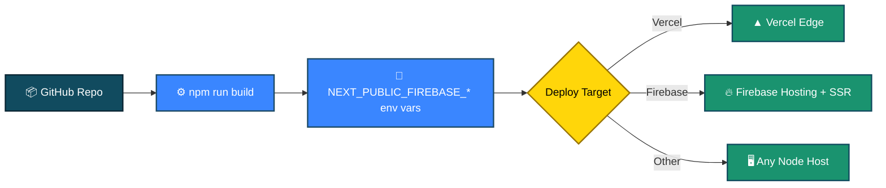

<div align="center">


<a href="https://github.com/PabasaraIlankoon/elevision-web">
  
</a>

<br><br>

[](https://nextjs.org)
[](https://www.typescriptlang.org)
[](https://firebase.google.com)
[](https://tailwindcss.com)
[](https://leafletjs.com)

[](LICENSE)


</div>

<p align="center">
<b>Elevision Web</b> is a real-time operations dashboard for railway control rooms. It's the web counterpart to the
<a href="https://github.com/PabasaraIlankoon/elevision-app">Elevision Flutter mobile app</a> and the Raspberry Pi
detection nodes - all three share a single Firebase project, so an elephant detected in the field appears on this
dashboard within seconds, with zero login required.
</p>

<div align="center">

[Overview](#-overview) • [Features](#-features) • [Architecture](#-system-architecture) • [Screenshots](#-dashboard-screens) • [Setup](#-getting-started) • [Tech Stack](#%EF%B8%8F-tech-stack)

</div>


## 📋 Table of Contents

- [Overview](#-overview)
- [Features](#-features)
- [System Architecture](#-system-architecture)
- [Dashboard Screens](#-dashboard-screens)
- [Data Model](#-data-model)
- [Getting Started](#-getting-started)
- [Firestore Rules & Deployment](#-firestore-rules--deployment)
- [Train Schedule Data](#-train-schedule-data)
- [Project Structure](#-project-structure)
- [Tech Stack](#%EF%B8%8F-tech-stack)
- [Deployment](#-deployment)
- [Related Repositories](#-related-repositories)

## 🌟 Overview

Elevision Web gives railway control room staff a real-time, publicly viewable window into the Elevision elephant
detection network. The moment a Raspberry Pi node in the field confirms a detection, it's written straight to
Firestore - and this dashboard, the mobile app, and every other connected screen update live, with no polling and
no manual refresh.

> **Why a web dashboard too?** Control rooms run on shared screens, not personal phones. Elevision Web is built to
> sit on a wall-mounted monitor - large hero alerts, a live device map, and zero login friction.


## ✨ Features

### 🚨 Live Dashboard
- Active alert hero card - image, location, device ID, confidence score
- One-tap **Acknowledge** to mark an alert as seen
- Real-time Firestore subscription, no page refresh needed

### 📜 Alert History
- Full feed of past detections
- Date-range filtering
- CSV export for record-keeping and reporting

### 🔍 Alert Detail
- Detection image with confidence breakdown
- Device, location, and GPS coordinates
- Embedded map of the alert location
- Live train risk assessment for that location
- Mark as reviewed / download image

### 🗺️ Map
- Sri Lanka railway zone map (Leaflet + OpenStreetMap)
- All device locations plotted with live status
- Active alerts highlighted on the map in real time

### 🛰️ Devices
- Online / offline status per detection node
- Coordinates and last-seen state for every Pi unit

### 🚂 Train Schedule
- High-risk train schedules near the elephant corridor
- Live "approaching" risk assessment, same engine as the mobile app

### 📊 Analytics
- Detection trends over time
- Confidence distribution statistics
- Top-detecting devices leaderboard

> **No authentication required** - this dashboard is intentionally public-read, designed for operations visibility rather than restricted access.


## 🏗 System Architecture



### 🔄 Live Alert Flow




## 📸 Dashboard Screens

<div align="center">

<table>
<tr>
<td align="center" width="25%">
<br>
<sub><b>Dashboard</b><br>Active alert hero, stats & quick actions</sub>
</td>
<td align="center" width="25%">
<br>
<sub><b>Alert History</b><br>Filterable feed with CSV export</sub>
</td>
<td align="center" width="25%">
<br>
<sub><b>Alert Detail</b><br>Confidence, GPS, map & train risk</sub>
</td>
<td align="center" width="25%">
<br>
<sub><b>Railway Zone Map</b><br>Live device & alert locations</sub>
</td>
</tr>
</table>

</div>


## 🗄 Data Model

The web dashboard reads from the **same Firestore database** as the Pi nodes and Flutter app — no separate backend.



| Collection / Document | Purpose |
|---|---|
| `alerts/{alertId}` | Each detection event: `timestampMs`, `imageUrl`, `confidence`, `deviceId`, `locationName`, `latitude`, `longitude`, `status` (`new` \| `seen`) |
| `system/devices` | Single flattened doc with `{deviceId}_lat`, `{deviceId}_lng`, `{deviceId}_name`, `{deviceId}_status` keys for every registered device |

Detection nodes (Raspberry Pi) write directly to Firestore via `firebase-admin`. The web app only **reads** `alerts`
and `system/devices`, and **writes** the `status` field on alerts (for Acknowledge / Mark as Reviewed).


## 🚀 Getting Started

### 1. Install dependencies

```bash
npm install
```

### 2. Configure Firebase

Copy the example env file:

```bash
cp .env.example .env.local
```

Fill in `.env.local` with your Firebase web app config from **Firebase Console → Project Settings → Your apps → Web app** (project `elevision-606a9`):

```bash
NEXT_PUBLIC_FIREBASE_API_KEY=your-api-key
NEXT_PUBLIC_FIREBASE_AUTH_DOMAIN=elevision-606a9.firebaseapp.com
NEXT_PUBLIC_FIREBASE_PROJECT_ID=elevision-606a9
NEXT_PUBLIC_FIREBASE_STORAGE_BUCKET=elevision-606a9.firebasestorage.app
NEXT_PUBLIC_FIREBASE_MESSAGING_SENDER_ID=863719577998
NEXT_PUBLIC_FIREBASE_APP_ID=your-web-app-id
```

> If you haven't registered a web app yet: **Firebase Console → Project Settings → "Your apps" → Add app → Web** → give it a nickname (e.g. *"Elevision Web Dashboard"*) → copy the generated config values above.

> ⚠️ **Important:** all variables must be prefixed with `NEXT_PUBLIC_`, and the dev server must be **fully restarted** (not hot-reloaded) after changing `.env.local`.

### 3. Run the dev server

```bash
npm run dev
```

Open **http://localhost:3000**.


## 🔐 Firestore Rules & Deployment

Rules live in `firestore.rules` and allow public read of alerts/device status, with writes restricted to toggling
an alert's `status`:

```bash
firebase login
firebase use elevision-606a9
firebase deploy --only firestore:rules
```

## 🚂 Train Schedule Data

High-risk train schedules near Gal Oya Junction are defined in `lib/trains/schedule.ts`, ported from the Flutter
app's train model.



> Update `lib/trains/schedule.ts` directly if train schedules change — no Firestore collection is involved.


## 📁 Project Structure

```
elevision-web/
│
├── app/
│   ├── dashboard/
│   │   ├── page.tsx                 ← Main dashboard (active alert + stats)
│   │   ├── history/                 ← Alert history + CSV export
│   │   ├── alerts/[id]/             ← Alert detail page
│   │   ├── map/                     ← Device map
│   │   ├── devices/                 ← Device status grid
│   │   ├── trains/                  ← Train schedule
│   │   └── analytics-report/        ← Analytics charts
│
├── components/
│   ├── cards/                       ← Alert / device / stat cards
│   ├── badges/                      ← Confidence / device status badges
│   ├── dashboard/                   ← Sidebar, topbar, map
│   └── branding/                    ← Logo
│
├── lib/
│   ├── firebase/                    ← Firestore config + subscriptions
│   ├── trains/                      ← Train schedule data + helpers
│   └── types.ts                     ← Shared TypeScript types
│
├── public/
│   ├── dashboard-web.jpeg           ← README screenshot
│   ├── alert-web.jpeg               ← README screenshot
│   ├── alert-detail-web.jpeg        ← README screenshot
│   └── map-web.jpeg                 ← README screenshot
│
├── firestore.rules
├── firebase.json
├── .env.example
└── README.md
```


## 🛠️ Tech Stack

| Layer | Technology |
|---|---|
| Framework | Next.js (App Router) + TypeScript |
| Database | Firebase Firestore — real-time data (alerts, device status) |
| Styling | Tailwind CSS |
| Maps | react-leaflet + OpenStreetMap |
| Charts | Recharts |
| Animation | Framer Motion |
| Icons | lucide-react |
| Hosting | Vercel / Firebase Hosting / any Node host |


## ☁️ Deployment

This is a standard Next.js app — deploy to **Vercel**, **Firebase Hosting** (with Cloud Functions for SSR), or any
Node host. Set the same `NEXT_PUBLIC_FIREBASE_*` environment variables in your hosting provider's dashboard.



## 🔗 Related Repositories

| Repo | Description |
|---|---|
| [elevision-app](https://github.com/PabasaraIlankoon/elevision-app) | Flutter mobile app + Raspberry Pi detection pipeline |
| **elevision-web** *(this repo)* | Next.js operations dashboard |

## 📄 License

MIT License — Copyright (c) 2026 Elevision Team

Permission is hereby granted, free of charge, to any person obtaining a copy of this software and associated documentation files (the "Software"), to deal in the Software without restriction, including without limitation the rights to use, copy, modify, merge, publish, distribute, sublicense, and/or sell copies of the Software, and to permit persons to whom the Software is furnished to do so.

<div align="center">

### 🐘 "Every elephant saved is a victory for conservation" 🐘


<sub>Built with 🐘 by the <b>Elevision Team</b></sub>

</div>
